### Escuela Colombiana de Ingeniería
### Arquitecturas de Software - ARSW
## Ejercicio Introducción al paralelismo - Hilos - Caso BlackListSearch
## Autor : Roger Alexander Rodriguez

### Dependencias:
####   Lecturas:
*  [Threads in Java](http://beginnersbook.com/2013/03/java-threads/)  (Hasta 'Ending Threads')
*  [Threads vs Processes]( http://cs-fundamentals.com/tech-interview/java/differences-between-thread-and-process-in-java.php)
----
### Descripción
  Este ejercicio contiene una introducción a la programación con hilos en Java, además de la aplicación a un caso concreto.
  
## Desarrollo

### **Parte I - Introducción a Hilos en Java**

1. De acuerdo con lo revisado en las lecturas, complete las clases CountThread, para que las mismas definan el ciclo de vida de un hilo que imprima por pantalla los números entre A y B.
2. Complete el método __main__ de la clase CountMainThreads para que:
	1. Cree 3 hilos de tipo CountThread, asignándole al primero el intervalo [0..99], al segundo [99..199], y al tercero [200..299].
	2. Inicie los tres hilos con 'start()'.

El metodo en la clase __main__ quedaria tal que así :

```{java}

	package edu.eci.arsw.threads;

	/**
	*
	* @author hcadavid
	*/
	public class CountThreadsMain {
		
		public static void main(String a[]){
			CountThread ct1 = new CountThread(0,99);
			CountThread ct2 = new CountThread(99,199);     
			CountThread ct3 = new CountThread(200,299);

			ct1.start();   
			ct2.start();
			ct3.start();             
		}   
	}
```

La clase CountThread quedaria tal que asi : 


```{java}

package edu.eci.arsw.threads;

public class CountThread extends Thread{
    
    private int A;
    private int B;
    
    public CountThread(int A ,int B){
        this.A = A;
        this.B = B;
    }
    
    @Override
    public void run(){
        for (int i=A;i<=B;i++){
            System.out.println("Thread No. "+ getName() + " i=" + i);
        }
   
    }

```


3. Ejecute y revise la salida por pantalla. 


Al ejecutar la clase principal utilizando respectivamente el metodo 'start()' y la siguiente seria la salida (para mayor entendimiento en la clase CountThread en el metodo 'run()'hacemos que nos indique el nombre del hilo el cual esta realizando la tarea ): 

.png)

4. Cambie el incio con 'start()' por 'run()'. Cómo cambia la salida?, por qué?.

Al cambiar el método 'start()' por el método 'run()', lo que hacemos es ejecutar el método de la clase como un método normal. Este se ejecuta en el mismo hilo, por lo cual no permite la realización de tareas en paralelo. En cambio, al llamar el método 'start()', se crea un nuevo hilo que justo luego invoca el método 'run()' de manera interna, permitiendo que el programa se ejecute de forma concurrente.


Ejecucion con el metodo 'run()':


```{java}
	public class CountThreadsMain {
    
    public static void main(String a[]){
        CountThread ct1=new CountThread(0,99);
        CountThread ct2=new CountThread(99,199);     
        CountThread ct3=new CountThread(200,299);
        ct1.run();   
        ct2.run();
        ct3.run();             
    }
```

Salida:

.png)


### **Parte II - Ejercicio Black List Search**


Para un software de vigilancia automática de seguridad informática se está desarrollando un componente encargado de validar las direcciones IP en varios miles de listas negras (de host maliciosos) conocidas, y reportar aquellas que existan en al menos cinco de dichas listas. 

Dicho componente está diseñado de acuerdo con el siguiente diagrama, donde:

- HostBlackListsDataSourceFacade es una clase que ofrece una 'fachada' para realizar consultas en cualquiera de las N listas negras registradas (método 'isInBlacklistServer'), y que permite también hacer un reporte a una base de datos local de cuando una dirección IP se considera peligrosa. Esta clase NO ES MODIFICABLE, pero se sabe que es 'Thread-Safe'.

- HostBlackListsValidator es una clase que ofrece el método 'checkHost', el cual, a través de la clase 'HostBlackListDataSourceFacade', valida en cada una de las listas negras un host determinado. En dicho método está considerada la política de que al encontrarse un HOST en al menos cinco listas negras, el mismo será registrado como 'no confiable', o como 'confiable' en caso contrario. Adicionalmente, retornará la lista de los números de las 'listas negras' en donde se encontró registrado el HOST.


Al usarse el módulo, la evidencia de que se hizo el registro como 'confiable' o 'no confiable' se dá por lo mensajes de LOGs:

INFO: HOST 205.24.34.55 Reported as trustworthy

INFO: HOST 205.24.34.55 Reported as NOT trustworthy


Al programa de prueba provisto (Main), le toma sólo algunos segundos análizar y reportar la dirección provista (200.24.34.55), ya que la misma está registrada más de cinco veces en los primeros servidores, por lo que no requiere recorrerlos todos. Sin embargo, hacer la búsqueda en casos donde NO hay reportes, o donde los mismos están dispersos en las miles de listas negras, toma bastante tiempo.

Éste, como cualquier método de búsqueda, puede verse como un problema [vergonzosamente paralelo](https://en.wikipedia.org/wiki/Embarrassingly_parallel), ya que no existen dependencias entre una partición del problema y otra.

Para que este código pueda hacer que explote la capacidad multi-núcleo de la CPU del equipo, realicé lo siguiente:

1. Cree una clase de tipo Thread que represente el ciclo de vida de un hilo que haga la búsqueda de un segmento del conjunto de servidores disponibles y agregamos a dicha clase un método que permite 'preguntarle' a las instancias del mismo (los hilos) cuantas ocurrencias de servidores maliciosos ha encontrado o encontró.

```{java}
	public class SearchBlackListThread extends Thread {

    private int start;
    private int end;
    private String ip;
    private List<Integer> results;

    public SearchBlackListThread(int start, int end,String ip,List<Integer> results) {
        this.start = start;
        this.end = end;
        this.ip = ip;
        this.results = results;
    }

    @Override
    public void run() {
        HostBlacklistsDataSourceFacade skds =HostBlacklistsDataSourceFacade.getInstance();
        for (int i = start; i < end; i++) {
            if (skds.isInBlackListServer(i, ip)) {
                results.add(i); 
            }
        }
    }
}
```
1. Agregamos al método 'checkHost' un parámetro entero N, correspondiente al número de hilos entre los que se va a realizar la búsqueda . Agregue el código de este método para que divida el espacio de búsqueda entre las N partes indicadas, y paralelice la búsqueda a través de N hilos. Hice que dicha función esperara hasta que los N hilos terminen de resolver su respectivo sub-problema para luego agregar las ocurrencias encontradas por cada hilo a la lista que es retornada por el método, y entonces se calcula si el número de ocurrencias es mayor o igual a _BLACK_LIST_ALARM_COUNT_. Si se da este caso, al final se reporta el host como confiable o no confiable, y muestra el listado con los números de las listas negras respectivas. 

```{java}
public class HostBlackListsValidator {

    private static final int BLACK_LIST_ALARM_COUNT = 5;

    public List<Integer> checkHost(String ipaddress, int N) {

        LinkedList<Integer> blackListOcurrences = new LinkedList<>();
        List<SearchBlackListThread> threads = new LinkedList<>();

        HostBlacklistsDataSourceFacade skds =HostBlacklistsDataSourceFacade.getInstance();

        int totalServers = skds.getRegisteredServersCount();
        int divisions = totalServers / N;

        for (int i = 0; i < N; i++) {
            int start = i * divisions;
            int end = 0;
            if (i == N - 1) {
                end = totalServers;
            }else {
                end = (i + 1) * divisions;
            }
            SearchBlackListThread t = new SearchBlackListThread(start, end, ipaddress, blackListOcurrences);
            threads.add(t);
            t.start();
        }

        for (SearchBlackListThread t : threads) {
            try {
                t.join();
            } catch (InterruptedException e) {
                Logger.getLogger(HostBlackListsValidator.class.getName())
                        .log(Level.SEVERE, null, e);
            }
        }

        if (blackListOcurrences.size() >= BLACK_LIST_ALARM_COUNT) {
            skds.reportAsNotTrustworthy(ipaddress);
        } else {
            skds.reportAsTrustworthy(ipaddress);
        }

        LOG.log(Level.INFO,"Checked Black Lists:{0} of {1}",new Object[]{totalServers, totalServers});
        return blackListOcurrences;
    }

    private static final Logger LOG =
            Logger.getLogger(HostBlackListsValidator.class.getName());
}

```

Para lograr este comportamiento use el método [join](https://docs.oracle.com/javase/tutorial/essential/concurrency/join.html) del API de concurrencia de Java. 


```{java}

	for (SearchBlackListThread t : threads) {
            try {
                t.join();
            } catch (InterruptedException e) {
                Logger.getLogger(HostBlackListsValidator.class.getName())
                        .log(Level.SEVERE, null, e);
            }
        }

```

	
* Dentro del método checkHost Se maintiene el LOG que informa, antes de retornar el resultado, el número de listas negras revisadas VS. el número de listas negras total. Se debe garantizar que dicha información sea verídica bajo el nuevo esquema de procesamiento en paralelo planteado.
  

```{java}

private static final Logger LOG =
            Logger.getLogger(HostBlackListsValidator.class.getName());

```

* Se sabe que el HOST 202.24.34.55 está reportado en listas negras de una forma más dispersa, y que el host 212.24.24.55 NO está en ninguna lista negra por lo cual probamos el correcto funcionamiento del programa en base a esto :

**Validando 202.24.34.55**

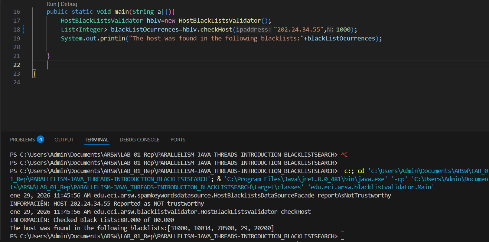

**Validando 212.24.34.55**

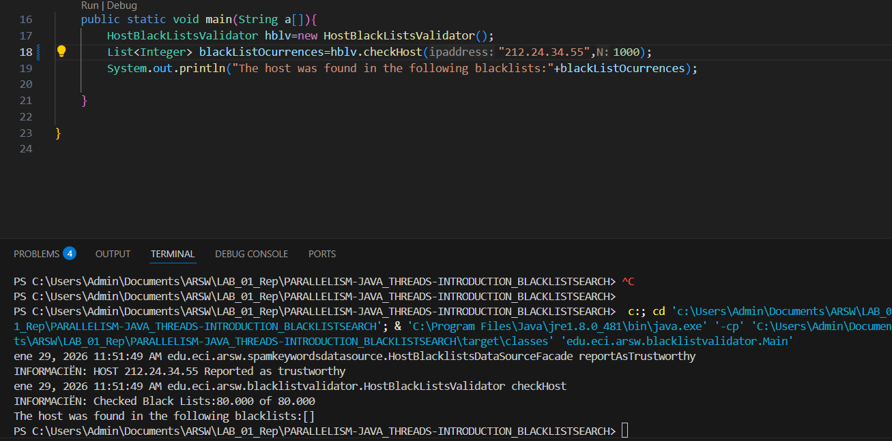


### **Parte II.I**

La estrategia de paralelismo antes implementada es ineficiente en ciertos casos, pues la búsqueda se sigue realizando aún cuando los N hilos (en su conjunto) ya hayan encontrado el número mínimo de ocurrencias requeridas para reportar al servidor como malicioso. 
Se podría modificar la implementación para minimizar el número de consultas en estos casos si en el momento en que se tienen las 5 concidencias todos los hilos se detienen para dar paso al hilo principalesto lo logramos utilizando la [Sincronización](https://docs.oracle.com/javase/tutorial/essential/concurrency/sync.html) del API de concurrencia de Java. 

- En una variable que todos los hilos puedan ver indicamos si se debe de detener la ejecicion .
- Implementamos un metodo 'Stop()' que permita consultar si debe detener ademas este debe estar sincronizado para que solo un hilo consulte a la vez y siempre obtenga el valor actualizado. 
- Implementamos un metodo 'setStop()' que permita cambiar el valor dentro de la variable stop , este tambien debe de estar sincronizado para que todos los hilos puedan verlo y no sobreeescribirlo.

```{java}
public boolean stop = false;

public synchronized boolean Stop() {
    return stop;
}

public synchronized void setStop() {
    stop = true;
}
```

- Agregamos el validador dentro del hilo :

```{java}

private HostBlackListsValidator validator = new HostBlackListsValidator();
public void run() {
        HostBlacklistsDataSourceFacade skds =HostBlacklistsDataSourceFacade.getInstance();
        for (int i = start; i < end && !validator.Stop(); i++) {
            if (skds.isInBlackListServer(i, ip)) {
                results.add(i); 
                if (results.size() >= 5) {
                    validator.setStop();
              }
        }
    }

```

### **Parte III - Evaluación de Desempeño** 

A partir de lo anterior, implemente la siguiente secuencia de experimentos para realizar las validación de direcciones IP dispersas (por ejemplo 202.24.34.55), tomando los tiempos de ejecución de los mismos:

1. Un solo hilo.
2. Tantos hilos como núcleos de procesamiento (haga que el programa determine esto haciendo uso del [API Runtime](https://docs.oracle.com/javase/7/docs/api/java/lang/Runtime.html)).
3. Tantos hilos como el doble de núcleos de procesamiento.
4. 50 hilos.
5. 100 hilos.
   
Al iniciar el programa se ejecuta el monitor jVisualVM, y a medida que corrian las pruebas, revisamos el consumo de CPU y de memoria en cada caso. 


Para esto preparamos la funcion 'main()' para realizar los test , con esto tendriamos como nuesta funcion principal lo siguiente:

```{java}
	public class Main {
    
    public static void main(String a[]){
        HostBlackListsValidator validator = new HostBlackListsValidator();
        String ip = "202.24.34.55";
        int cores = Runtime.getRuntime().availableProcessors();

        int[] tests = {  
            1,
            cores,
            cores * 2,
            100
        };

        for (int nThreads : tests) {

            long start = System.currentTimeMillis();

            validator.checkHost(ip, nThreads);

            long end = System.currentTimeMillis();

            System.out.println(
                "Hilos: " + nThreads +
                " | Tiempo: " + (end - start) + " ms"
            );
        }
    }
}
```

Encapsulamos los escenarios en una lista llamada test para la entrega pero a continuacion y para mejor facilidad del ejercicio ejecutamos caso por caso .

### Monitoreo:

**1. Un solo hilo**

- Monitoreo en visualVM:
  
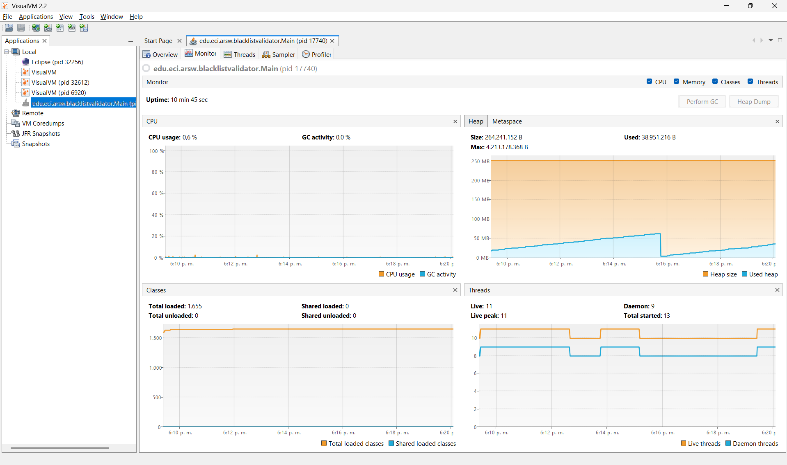

- Tiempo : 
  
 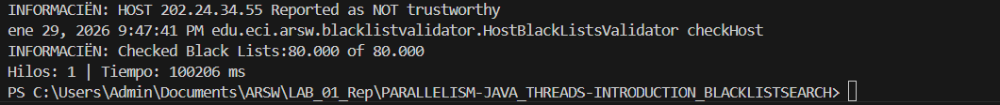 

 **2. Tantos hilos como nucleos de procesamiento**

- Monitoreo en visualVM:
  
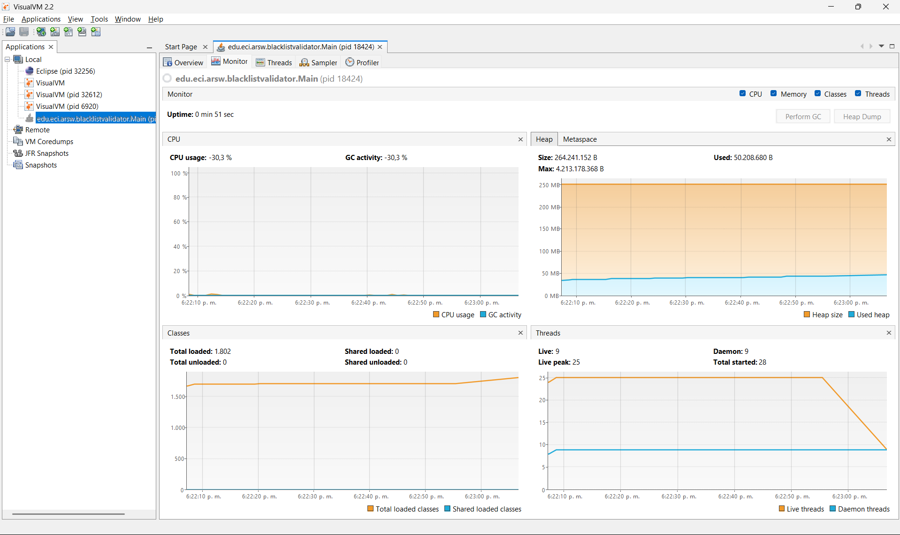

- Tiempo : 
  
 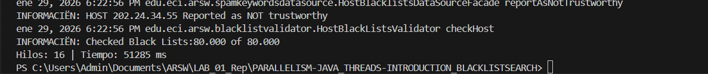 

 **3. Tantos hilos como el doble de nucleos**

- Monitoreo en visualVM:
  
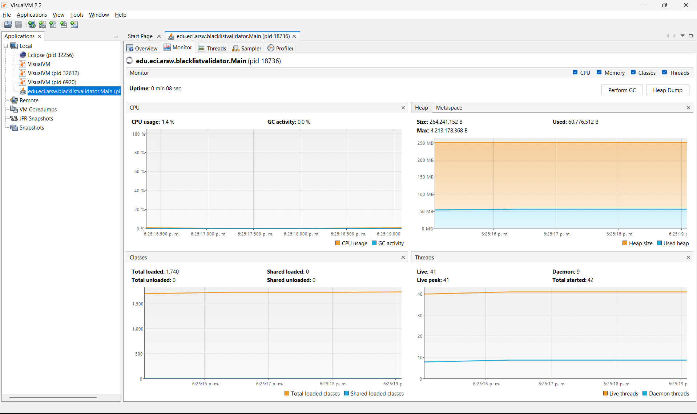

- Tiempo : 
  
 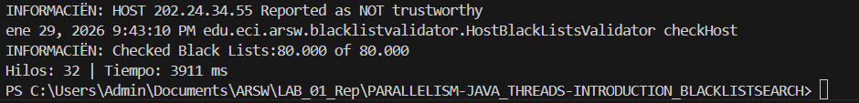 

 **4. 50 hilos**

 - Monitoreo en visualVM:
  
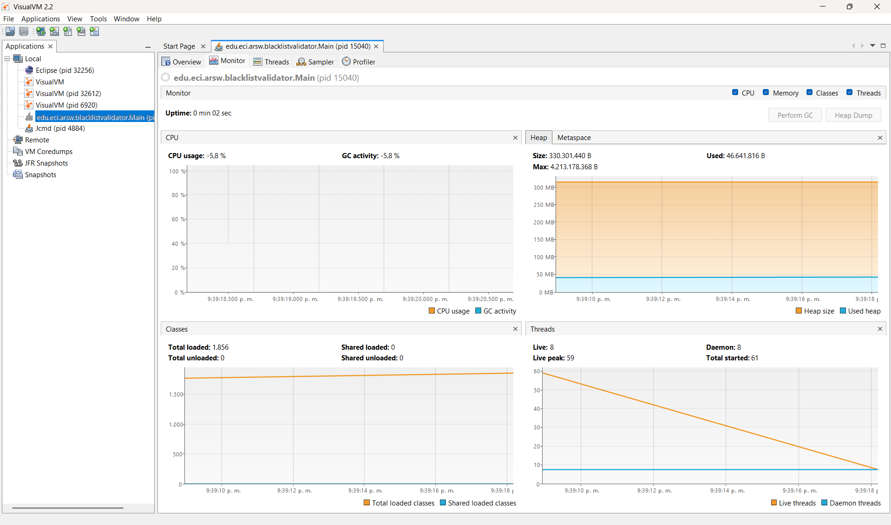

- Tiempo : 
  
 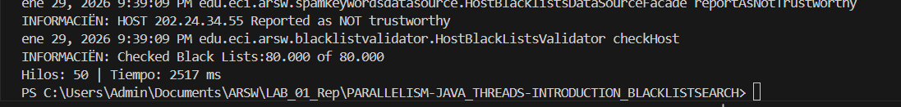 

 **5. 100 hilos**

 - Monitoreo en visualVM:
  
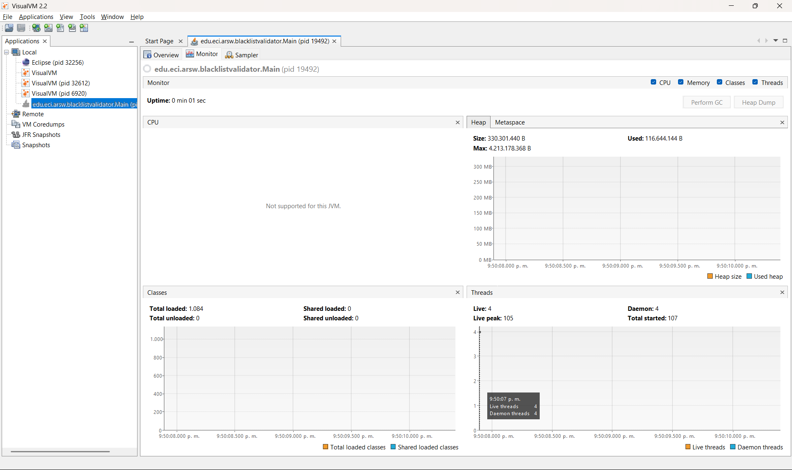

- Tiempo : 
  
 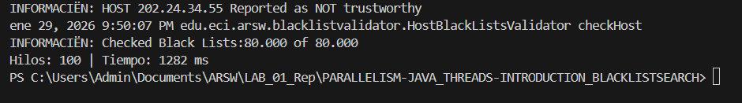 

Con lo anterior, y con los tiempos de ejecución dados, realizamos una grafica de tiempo de solución vs. número de hilos:

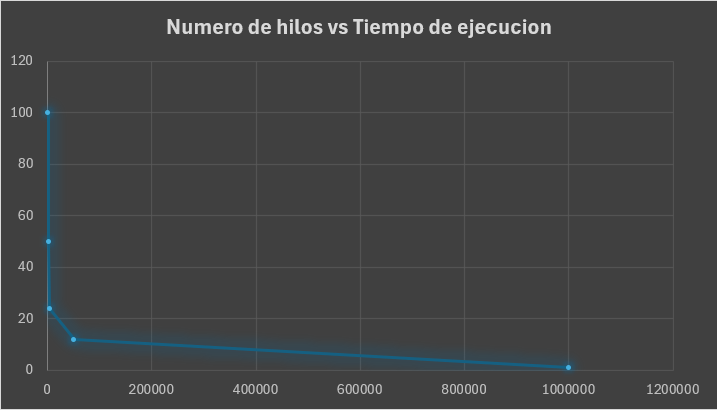 

Al analizar el comportamiento de la grafica tenemos que al aumentar el número de hilos desde 1 tambien tomando un número de núcleos del procesador hasta 100 hilos, el tiempo de ejecución disminuye, ya que el trabajo se distribuye entre varios núcleos y se aprovecha mejor el paralelismo.

### **Parte IV - Ejercicio Black List Search**

1. Según la [ley de Amdahls](https://www.pugetsystems.com/labs/articles/Estimating-CPU-Performance-using-Amdahls-Law-619/#WhatisAmdahlsLaw?):

	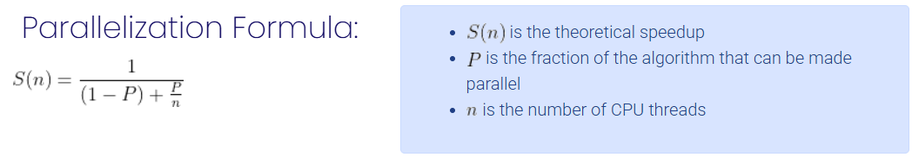

	Donde _S(n)_ es el mejoramiento teórico del desempeño, _P_ la fracción paralelizable del algoritmo, y _n_ el número de hilos, a mayor _n_, mayor debería ser dicha mejora. Por qué el mejor desempeño no se logra con los 500 hilos?, cómo se compara este desempeño cuando se usan 200?. 

**Respuesta**

Aunque teoricamente al aumentar el número de hilos el desempeño debería mejorar, en la práctica esto no ocurre para siempre ya que al usar 500 hilos , el desempeño fue peor que al usar 200 hilos esto se debe a que la  CPU tiene un numero finito de nucleos, por lo que muchos hilos no pueden ejecutarse en paralelo realmente; ademas que el programa  se sobrecarga por la administracion de hilos.Esto se ve mas claramente con 1000 hilos y 500 donde el desempeño de los 500 hilos fue mucho mejor al de 100 hilos debido a lo ya menconado.

- **Desempeño 1000 hilos**

 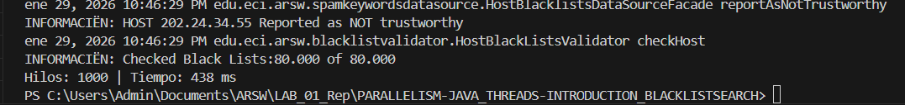 

- **Desempeño 500 hilos**

 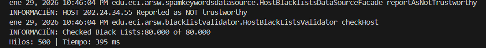 

En comparación, con 500 hilos el sistema presenta menos sobrecarga y un uso más eficiente del CPU, logrando un mejor tiempo de ejecución que con 1000 hilos;Aunque Amdahl predice mejora al aumentar n, en sistemas reales la sobrecarga y las secciones no paralelizables limitan el beneficio, haciendo que muchos hilos sean contraproducentes.

2. Cómo se comporta la solución usando tantos hilos de procesamiento como núcleos comparado con el resultado de usar el doble de éste?.

Al usar tantos hilos como núcleos de procesamiento, el algoritmo alcanza un desempeño cercano al optimo ya que se supone que cada hilo puede ejecutarse en un nucleo fisico minimizando la espera entre hilos y aprovechando  eficientemente el paralelismo real del hardware.

Cuando se usa el doble de hilos que núcleos, el desempeño no mejora significativamente e incluso segun la teoria puede empeorar ligeramente, esto por que los hilos comienzan a competir por los mismos nucleos se aumenta el consumo de memoria y la carga .

En conclusion el paralelismo optimo se alcanza cuando el numero de hilos es similar al nmero de nucleos disponibles.


3. De acuerdo con lo anterior, si para este problema en lugar de 100 hilos en una sola CPU se pudiera usar 1 hilo en cada una de 100 máquinas hipotéticas, la ley de Amdahls se aplicaría mejor?. Si en lugar de esto se usaran c hilos en 100/c máquinas distribuidas (siendo c es el número de núcleos de dichas máquinas), se mejoraría?. 
   
-  Caso 1 - 1 hilo en cada una de 100 maquinas:
  
En este escenario, la Ley de Amdahl se aplicaria mejor, porque cada hilo se ejecuta en un nucleo fisico distinto por lo cual no hay competencia local por CPU reduciendose asi la sobrecarga .

Sin embargo, aparece un nuevo factor que no es considerado directamente podrian ser los costos de comunicacion y coordinacion entre maquinas.Si el problema requiere poca comunicacion, el desempeño puede ser mejor que en una sola maquina.

- Caso 2 - c hilos en 100/c máquinas (c = nucleos por maquina):

Este escenario puede ser aun mas eficiente, porque cada maquina usa sus nucleos de una forma optima ademas de que se reduce el numero total de maquinas, disminuyendo la comunicacion manteniendo el paralelismo real sin saturar CPUs locales.

El rendimiento mejora si la carga esta bien balanceada,la comunicación es mínima y el problema es muy paralelizable.
